# Benchmarking Popular NodeJS Logging Libraries

Loggly ran a series of performance tests on some of the most popular node js
libraries. These tests are designed to show how quickly each library processed
logging and  impact on the overall application.

## The Contenders

For this test, we investigated some of the most commonly used Nodejs logging
libraries:

* `log4js`
* `winston`
* `bunyan`

We also used the following additional libraries

* `winston-syslog` for syslog logging with winston
* `node-bunyan-syslog` for syslog logging with bunyan

We sent log info to a local rsyslog server over both TCP and UDP.

## Setup and Configuration

Our goal was to measure the amount of time needed to log. Each library is on its
default configuration and its the same across all libraries and tests

## The Test Project

Our test application logged a total of 1,000,000 log events. The tests were done
three times and results were averaged. While logging for a typical application
you may not put it through similar load but it helps in figuring efficiency of
logging libraries. In most situations you will not see dropped events as they
are usually spread out.

The source code for the project is on GitHub at
[https://github.com/codejamninja/node-log-benchmarks](https://github.com/codejamninja/node-log-benchmarks).

## Hardware and Software

| Name             | Spec                                              |
|------------------|---------------------------------------------------|
| Processors       | Intel Core i7-7700 @ 2.80GHz (4 cores, 8 threads) |
| Memory           | 32GB Ram                                          |
| Operating System | 64-bit Ubuntu 18.04.2 LTS Server                  |
| NodeJS           | 8.15.1 LTS                                        |

## Test Results

For all tests, the results are measured in milliseconds.

### Console

For the first set of test results, we benchmarked the performance of the
libraries when logging to the console.

#### log4js

_1cpu_


_8cpus_


|             |     1 CPU |    8 CPUs |
|-------------|-----------|-----------|
| Test 1      |     67887 |     23936 |
| Test 2      |     64484 |     23741 |
| Test 3      |     68626 |     25478 |
| **Average** | **66999** | **24385** |

From these results we can see additional CPUs had a significant effect on the
amount of time it took log4js to log to the console.

#### winston

_1cpu_


_8cpus_


|             |     1 CPU |    8 CPUs |
|-------------|-----------|-----------|
| Test 1      |     32128 |     11010 |
| Test 2      |     31186 |     10591 |
| Test 3      |     29844 |     10666 |
| **Average** | **31053** | **10756** |

Again, additional CPUs had an large effect on the time with winston.

#### bunyan

_1cpu_


_8cpus_


|             |     1 CPU |    8 CPUs |
|-------------|-----------|-----------|
| Test 1      |     29144 |     14998 |
| Test 2      |     28728 |     15324 |
| Test 3      |     31656 |     14863 |
| **Average** | **29843** | **15062** |

While additional CPUs had an effect on the time with bunyan, it had less of an
effect than the previous logging libraries.

#### Console Summary

|         | 1 CPU | 8 CPUs |
|---------|-------|--------|
| log4js  | 66999 |  24385 |
| winston | 31053 |  10756 |
| bunyan  | 29843 |  15062 |


It surprised me that additional CPUs had a significant effect on the time
because NodeJS is a single threaded program. However, technically it's just the
event loop that is single threaded. There are many NodeJS tasks that take place
on parallel threads, such as garbage collection. It's also worth noting that
the tty (terminal) was doing a bunch of work printing the logs to the screen,
which would have most definitely executed on a separate thread.

Looking at the results, winston is the clear winner for speed in multithreaded
systems, however bunyan performed slightly better in a single threaded
system.

### Filesystem

For the second set of test results, we benchmarked the performance of the
libraries when writing the logs to the filesystem.

Notice that each test result contains two times, _unblocked_  and _done_. This
is because NodeJS filesystem writes are nonblocking (asyncronous). The
_unblocked_ time lets us know when the code used to schedule the filesystem
writes is finished and the system can continue executing additional business
logic. However, the filesystem will still be asyncronously writing in the
background. So, the _done_ time lets us know how long it took to actually write
the logs to the filesystem.

#### log4js

_1cpu_


_8cpus_


|             |       1 CPU |    1 CPU |      8 CPUs |    8 CPUs |
|-------------|-------------|-----------|-------------|-----------|
|             | _unblocked_ |    _done_ | _unblocked_ |    _done_ |
| Test 1      |       15983 |     32228 |       15241 |     31529 |
| Test 2      |       16939 |     33576 |       15450 |     31332 |
| Test 3      |       14749 |     31023 |       15055 |     31890 |
| **Average** |   **15890** | **32276** |   **15249** | **31584** |

It's interesting that additional CPUs had little effect on the time with the
log4js library.

#### winston

_1cpu_


_8cpus_


|             |       1 CPU |   1 CPU |      8 CPUs |   8 CPUs |
|-------------|-------------|----------|-------------|----------|
|             | _unblocked_ |   _done_ | _unblocked_ |   _done_ |
| Test 1      |         691 |     8891 |         431 |     7351 |
| Test 2      |         722 |     9169 |         497 |     7360 |
| Test 3      |         760 |     8885 |         497 |     7602 |
| **Average** |     **724** | **8982** |     **475** | **7438** |

Again, with winston, additional CPUs seemed to have a small effect on the time.

#### bunyan

_1cpu_


_8cpus_


|             |       1 CPU |   1 CPU |      8 CPUs |   8 CPUs |
|-------------|-------------|----------|-------------|----------|
|             | _unblocked_ |   _done_ | _unblocked_ |   _done_ |
| Test 1      |        4212 |     4476 |        3815 |     4059 |
| Test 2      |        4264 |     4507 |        4113 |     4358 |
| Test 3      |        4076 |     4351 |        3935 |     4175 |
| **Average** |    **4184** | **4445** |    **3954** | **4197** |

Surprisingly again, additional CPUs had little effect on the results with
bunyan.

#### Filesystem Summary

|         |       1 CPU | 1 CPU |      8 CPUs | 8 CPUs |
|---------|-------------|--------|-------------|--------|
|         | _unblocked_ | _done_ | _unblocked_ | _done_ |
| log4js  |       15890 |  32276 |       15249 |  31584 |
| winston |         724 |   8982 |         475 |   7438 |
| bunyan  |        4184 |   4445 |        3954 |   4197 |

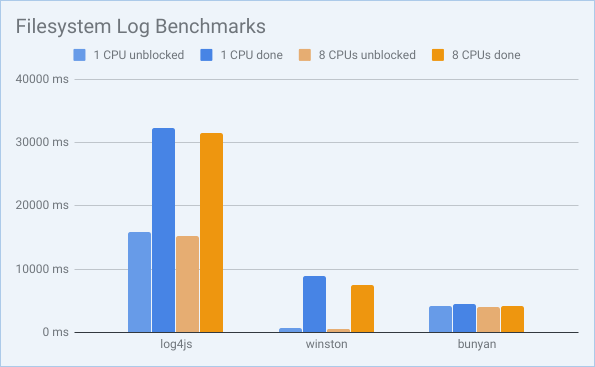

After seeing how much additional CPUs effected console logs, I was very
surprised to see that logging to the filesystem performed roughly the same with
additional CPUs. This is mostly likely because the work required to write files
is much less than the work required to print to a tty device, so less
multithreaded activity was happening.

Log4js seemed to have the worst results writing to a filesystem, sometimes
taking over 5 times the amount of time to write to the filesystem. Winston
unblocked the event loop the fastest, but bunyan finished writing to the
filesystem the fastest. So, if you're choosing a log library based on filesystem
performance, the choice would depend on weather you want the event loop
unblocked the fastest or if you want the overall program execution to finish
first.

### Syslog UDP

For the third set of test results, we benchmarked the performance of the
libraries when sending the logs to syslog over UDP.

Again, notice that each test result contains two times, _unblocked_  and _done_.
This is because the libraries sometimes asyncronously send the logs to syslog.

#### log4js

_1cpu_

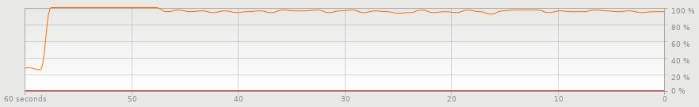

_8cpus_

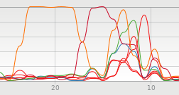

|             |       1 CPU |     1 CPU |       1 CPU |      8 CPUs |    8 CPUs |      8 CPUs |
|-------------|-------------|-----------|-------------|-------------|-----------|-------------|
|             | _unblocked_ |    _done_ | _drop rate_ | _unblocked_ |    _done_ | _drop rate_ |
| Test 1      |        6117 |     60486 |       0.00% |        5912 |     11891 |       0.00% |
| Test 2      |        6303 |     58396 |       0.00% |        6101 |     12255 |       0.00% |
| Test 3      |        6214 |     59609 |       0.00% |        5635 |     11719 |       0.00% |
| **Average** |    **6211** | **59497** |   **0.00%** |    **5883** | **11955** |   **0.00%** |

For log4js, additional CPUs had a profound effect on the time it took to send
the logs to syslog over UDP. However, if you look closely, you will notice that
the event loop was unblocked at roughly the same time regardless of the number
of CPUs. This is again because the event loop runs on a single thread.

The first graph showing the single CPU usage is very insightful. We can visually
see that the CPU is at 100% performance but then drops of slightly. It drops at
the exact moment the event loop is unblocked. The majority of the time, NodeJS
is sitting around doing very little work while it waits for syslog to finish
receiving and processing all of the logs. The same thing happens when there are
multiple CPUs, but it's harder to spot in the graph.

#### winston

_1cpu_

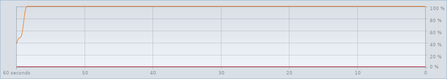

_8cpus_

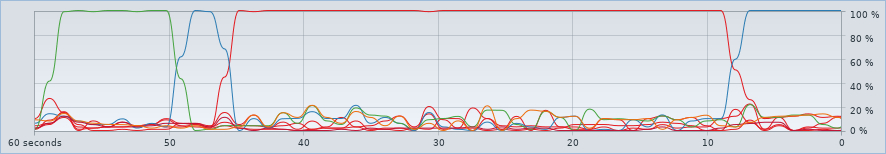

|             | 1 CPU       | 1 CPU   | 1 CPU       | 8 CPUs      | 8 CPUs     | 8 CPUs      |
|-------------|-------------|---------|-------------|-------------|------------|-------------|
|             | _unblocked_ | _done_  | _drop rate_ | _unblocked_ | _done_     | _drop rate_ |
| Test 1      | N/A         | N/A     | N/A         | 76702       | 142871     | N/A         |
| Test 2      | N/A         | N/A     | N/A         | N/A         | N/A        | N/A         |
| Test 3      | N/A         | N/A     | N/A         | N/A         | N/A        | N/A         |
| **Average** | **N/A**     | **N/A** | **N/A**     | **76702**   | **142871** | **N/A**     |

I had a terrible expirience getting winston to work with syslog over UDP. First
of all, it's worth mentioning that when it did work it took well over a minute
to unblock the event loop, and took over two minutes to finish sending the logs
to syslog. However, most of the times I tested it, I ran out of memory before I
could finish.

```
#
# Fatal error in , line 0
# API fatal error handler returned after process out of memory
#
Illegal instruction (core dumped)
```

Most of the time the heap would run out of memory.

```
FATAL ERROR: CALL_AND_RETRY_LAST Allocation failed - JavaScript heap out of memory
```

I was unable to get it to work at all with 1 CPU. Again, due to memory
constraints. These were not particularly memory constraints from the computer,
but memory constraints in the default settings of NodeJS. It may be possible to
get it to work by setting the `--max-old-space-size` flag to a higher value.

I am assuming that when using UDP, the library aggregates all the logs in the
heap before sending them to syslog, instead of immediately streaming the logs
over to syslog. At any rate, it sends the logs over to syslog over UDP in a way
that does not work well when slammed with a million logs.

#### bunyan

_1cpu_

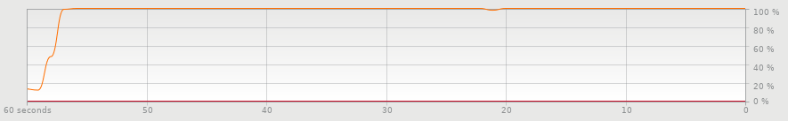

_8cpus_

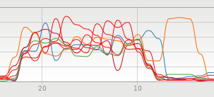

|             |       1 CPU |      1 CPU |       1 CPU |      8 CPUs |    8 CPUs |      8 CPUs |
|-------------|-------------|------------|-------------|-------------|-----------|-------------|
|             | _unblocked_ |     _done_ | _drop rate_ | _unblocked_ |    _done_ | _drop rate_ |
| Test 1      |      102314 |     102325 |       0.00% |       12188 |     12216 |       0.30% |
| Test 2      |      106427 |     106466 |       0.00% |       11425 |     11436 |       0.37% |
| Test 3      |      104309 |     104320 |       0.00% |       12424 |     12436 |       0.38% |
| **Average** |  **104350** | **104370** |   **0.00%** |   **12012** | **12029** |   **0.35%** |

Additional CPUs definitely increased the performance of sending logs to syslog
over UDP with bunyan.

Unlike the previous libraries, bunyan took roughly the same amount of time to
unblock the event loop as it took to finish sending the logs to syslog. This
probably means bunyan is executing the logs at roughly the same rate it is
sending the logs to syslog. It is worth noting that this observation happens
with 1 CPU as well as 8 CPUs. This may mean bunyan is sending the logs to syslog
synchronously instead of asynchronously.

Bunyan did drop some logs, although it's interesting that it consistently did not
drop any logs when executed on a single CPU.

#### Syslog UDP Summary

|         |       1 CPU |  1 CPU |       1 CPU |      8 CPUs | 8 CPUs |      8 CPUs |
|---------|-------------|--------|-------------|-------------|--------|-------------|
|         | _unblocked_ | _done_ | _drop rate_ | _unblocked_ | _done_ | _drop rate_ |
| log4js  |        6211 |  59497 |       0.00% |        5883 |  11955 |       0.00% |
| winston |             |        |             |       76702 | 142871 |             |
| bunyan  |      104350 | 104370 |       0.00% |       12012 |  12029 |       0.35% |

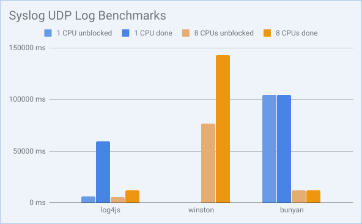

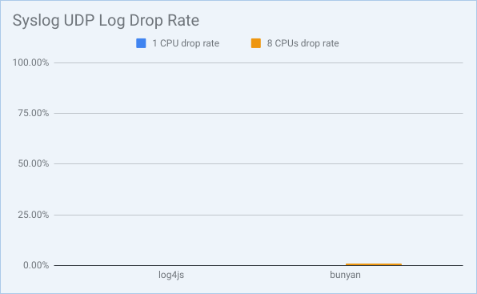

Because of the very poor performance of winston, I am not going to compare it
with log4js and bunyan.

Log4js and bunyan both finished around the same time when using multiple CPUs,
however log4js unblocked the event loop much sooner and performed better on a
single CPU.

Log4js also successfully sent all of its logs to syslog without dropping a
single one. Though bunyan had a low drop rate, it still managed to drop a few
logs. I would say log4js is a clear winner when sending logs to syslog over UDP.

## Syslog TCP

#### log4js

|             | 1 CPU       | 1 CPU   | 1 CPU       | 8 CPUs      | 8 CPUs  | 8 CPUs      |
|-------------|-------------|---------|-------------|-------------|---------|-------------|
|             | _unblocked_ | _done_  | _drop rate_ | _unblocked_ | _done_  | _drop rate_ |
| Test 1      | N/A         | N/A     | N/A         | N/A         | N/A     | N/A         |
| Test 2      | N/A         | N/A     | N/A         | N/A         | N/A     | N/A         |
| Test 3      | N/A         | N/A     | N/A         | N/A         | N/A     | N/A         |
| **Average** | **N/A**     | **N/A** | **N/A**     | **N/A**     | **N/A** | **N/A**     |

```
(node:31818) UnhandledPromiseRejectionWarning: TypeError: Cannot read property 'trace' of undefined
```

#### winston

_1cpu_

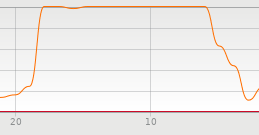

_8cpus_

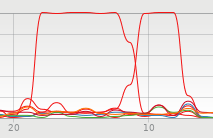

|             |       1 CPU |     1 CPU |       1 CPU |      8 CPUs |   8 CPUs |      8 CPUs |
|-------------|-------------|-----------|-------------|-------------|----------|-------------|
|             | _unblocked_ |    _done_ | _drop rate_ | _unblocked_ |   _done_ | _drop rate_ |
| Test 1      |       10132 |     10730 |      97.24% |        9236 |     9727 |      98.02% |
| Test 2      |       10872 |     11471 |      97.42% |        8836 |     8940 |      98.02% |
| Test 3      |       10858 |     10963 |      96.74% |        8923 |     9419 |      97.79% |
| **Average** |   **10621** | **11055** |  **97.13%** |    **8998** | **9362** |  **97.94%** |

#### bunyan

_1cpu_

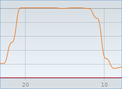

_8cpus_

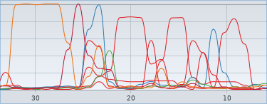

|             |       1 CPU |     1 CPU |       1 CPU |      8 CPUs |    8 CPUs |      8 CPUs |
|-------------|-------------|-----------|-------------|-------------|-----------|-------------|
|             | _unblocked_ |    _done_ | _drop rate_ | _unblocked_ |    _done_ | _drop rate_ |
| Test 1      |        6596 |     22523 |       0.00% |        6737 |     26168 |       0.00% |
| Test 2      |        6457 |     22271 |       0.00% |        6769 |     24518 |       0.00% |
| Test 3      |        6722 |     22434 |       0.00% |        6523 |     24267 |       0.00% |
| **Average** |    **6592** | **22409** |   **0.00%** |    **6676** | **24984** |   **0.00%** |

#### Syslog UDP Summary

|         | 1 CPU       | 1 CPU  | 1 CPU       | 8 CPUs      | 8 CPUs | 8 CPUs      |
|---------|-------------|--------|-------------|-------------|--------|-------------|
|         | _unblocked_ | _done_ | _drop rate_ | _unblocked_ | _done_ | _drop rate_ |
| log4js  | N/A         | N/A    | N/A         | N/A         | N/A    | N/A         |
| winston | 10621       | 11055  | 97.13%      | 8998        | 9362   | 97.94%      |
| bunyan  | 6592        | 22409  | 0.00%       | 6676        | 24984  | 0.00%       |

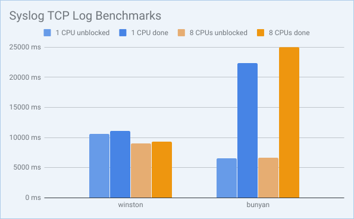

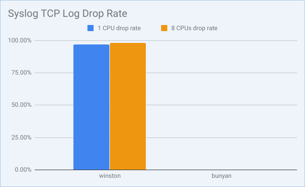
